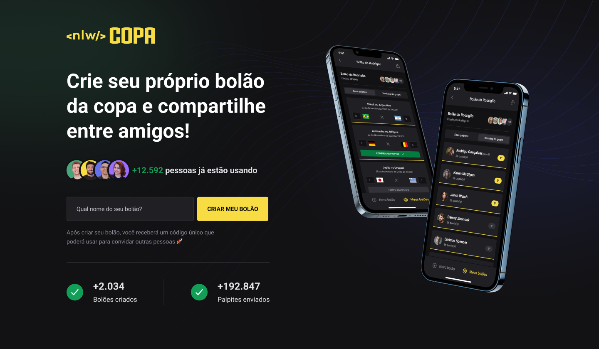

<h1 align="center">
  
</h1>

<p align="center">
  

  
  
  <a href="https://github.com/pabloxt14/NLW-Copa/commits/master">
    
  </a>
    
   

   <a href="https://github.com/pabloxt14/NLW-Copa/stargazers">
    
  </a>
</p>

<p>
  
</p>

<h4 align="center"> 
🚀 NLW Copa Concluído 🚀
</h4>

<p align="center">
 <a href="#-about">About</a> |
 <a href="#-layout">Layout</a> | 
 <a href="#-how-it-works">How It Works</a> | 
 <a href="#-technologies">Technologies</a> | 
 <a href="#-author">Author</a> | 
 <a href="#-license">License</a>
</p>


## 💻 About

O NLW Copa é uma aplicação com parte web, back-end e mobile, que tem como função a realização de bolões a respeito das partidas de jogos da copa do mundo, no qual esses bolões podem ser realizados entre conhecidos, amigos e até familiares.

O projeto foi desenvolvido durante a **NLW - Next Level Week** oferecida pela [Rocketseat](https://blog.rocketseat.com.br/primeira-next-level-week/). O NLW é uma experiência online com muito conteúdo prático, desafios e hacks onde o conteúdo fica disponível durante uma semana.

---

## 🎨 Layout

Você pode visualizar o layout do projeto através [desse link](https://www.figma.com/community/file/1169028343875283461). É necessário ter conta no [Figma](https://www.figma.com/) para acessá-lo.

Veja uma demonstração visual das principais telas da aplicação:

### Web

<p align="center">
  
</p>

### Mobile

<p align="center">
  
</p>

---

## 🚀 How it works

Este projeto é divido em três partes:
1. Backend (pasta server)
2. Frontend (pasta web)
3. Mobile (pasta mobile)

💡Tanto o Frontend quanto o Mobile precisam que o Backend esteja sendo executado para funcionar.

### Pré-requisitos

Antes de baixar o projeto você vai precisar ter instalado na sua máquina as seguintes ferramentas:

* [Git](https://git-scm.com)
* [NodeJS](https://nodejs.org/en/)
* [Yarn](https://yarnpkg.com/) ou [NPM](https://www.npmjs.com/)

Além disto é bom ter um editor para trabalhar com o código como [VSCode](https://code.visualstudio.com/)

### 🎲 Rodando o Backend (servidor)

```bash
# Clone este repositório
$ git clone git@github.com:pabloxt14/NLW-Copa.git

# Acesse a pasta do projeto no terminal/cmd
$ cd NLW-Copa

# Vá para a pasta server
$ cd server

# Instale as dependências
$ npm install

# Execute a aplicação em modo de desenvolvimento
$ npm run dev

# O servidor inciará na porta:3333 - acesse http://localhost:3333 
```

### 🧭 Rodando a aplicação web (Frontend)

```bash
# Vá para a pasta da aplicação Front End
$ cd web

# Instale as dependências
$ npm install

# Execute a aplicação em modo de desenvolvimento
$ npm run dev

# A aplicação será aberta na porta:3000 - acesse http://localhost:3000
```

### 📱 Rodando a aplicação mobile (Mobile)

```bash
# Vá para a pasta da aplicação mobile
$ cd mobile

# Instale as dependências
$ npm install

# Execute a aplicação em modo de desenvolvimento
$ npx expo start
```

---

## 🛠 Technologies

As seguintes ferramentas foram usadas na construção do projeto:

#### **Website** ([Next](https://nextjs.org/)  +  [TypeScript](https://www.typescriptlang.org/))

-   **[TailwindCSS](https://tailwindcss.com/)**
-   **[PostCSS](https://postcss.org/)**
-   **[Axios](https://github.com/axios/axios)**

> Para mais detalhes das dependências da parte `web` da aplicação veja o arquivo [package.json](https://github.com/pabloxt14/NLW-Copa/web/package.json)

#### **Server** ([NodeJS](https://nodejs.org/en/)  +  [TypeScript](https://www.typescriptlang.org/))

-   **[Fastify](https://www.fastify.io/)**
-   **[Zod](https://github.com/colinhacks/zod)**
-   **[Short-Unique-Id](https://www.npmjs.com/package/short-unique-id)**
-   **[Prisma](https://www.prisma.io/)**
-   **[SQLite](https://github.com/mapbox/node-sqlite3)**

> Para mais detalhes das dependências da parte de `server` da aplicação veja o arquivo  [package.json](https://github.com/pabloxt14/NLW-Copa/server/package.json)

#### **Mobile** ([React Native](http://www.reactnative.com/) + [TypeScript](https://www.typescriptlang.org/))
 
-   **[Expo](https://expo.io/)**
-   **[Expo Fonts](https://docs.expo.dev/guides/using-custom-fonts/)**
-   **[Expo Google Fonts](https://github.com/expo/google-fonts)**
-   **[Expo Auth Session](https://docs.expo.dev/versions/latest/sdk/auth-session/)**
-   **[Expo Web Browser](https://docs.expo.dev/versions/latest/sdk/webbrowser/)**
-   **[Native Base](https://nativebase.io/)**
-   **[Phosphor React Native](https://github.com/duongdev/phosphor-react-native)**
-   **[React Navigation](https://reactnavigation.org/)**
-   **[React Native SVG](https://github.com/react-native-community/react-native-svg)**
-   **[React Native Country Flag](https://www.npmjs.com/package/react-native-country-flag)**
-   **[Axios](https://github.com/axios/axios)**
-   **[Country-List](https://www.npmjs.com/package/country-list)**
-   **[DayJS](https://day.js.org/)**
-   **[dotENV](https://www.npmjs.com/package/dotenv)**

> Para mais detalhes das dependências da parte `mobile` da aplicação veja o arquivo  [package.json](https://github.com/pabloxt14/NLW-Copa/mobile/package.json)

---

## ✍ Author


[](https://www.linkedin.com/in/pabloalan/)

[](mailto:pabloxt14@gmail.com)

---

## 📝 License

Este projeto esta sobe a licença [MIT](./LICENSE).

Feito com 💜 por Pablo Alan 👋🏽 [Entre em contato!](https://www.linkedin.com/in/pabloalan/)
